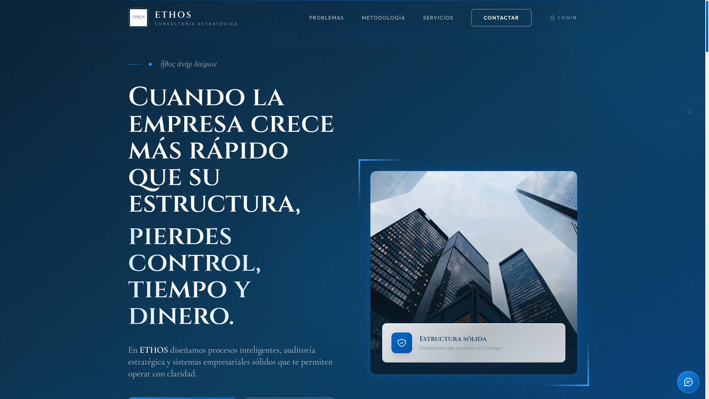

```markdown
<div align="center">
  

  # Plataforma ETHOS
  
  **Landing Page para Firma de Consultoría y Sistema de Gestión Interna**
</div>

## 📖 Resumen

ETHOS es una plataforma integral de grado de producción diseñada para una firma de consultoría. Cumple dos propósitos principales:
1. **Landing Page Pública**: Un sitio web público premium de alta conversión con una estética de lujo oscura, animaciones dinámicas y propuestas de valor de servicio claras.
2. **CRM Interno y Panel de Administración**: Un sistema de gestión interna rico en funciones que integra la plantilla de administración Vuexy, permitiendo al personal gestionar clientes, proyectos, transacciones POS y controles de acceso de manera fluida.

## ✨ Características Principales

- 🌟 **Landing Page Premium**: Un sitio orientado al público visualmente impactante con cursores personalizados, efectos de glassmorphism suaves y embudos de conversión distintos.
- 📊 **Panel de Administración Vuexy**: Un área de administración backend pulida para gestionar operaciones con paridad visual y funcional completa.
- 🔐 **Control de Acceso Basado en Roles**: Permisos y roles altamente granulares implementados de forma segura utilizando Spatie Laravel Permission.
- 💼 **CRM y Gestión de Proyectos**: Herramientas a medida para el seguimiento de relaciones con clientes, avance de proyectos activos y organización de tareas.
- 💳 **Integración de Punto de Venta (POS)**: Manejo de registro de pagos personalizados, incluyendo la alineación correcta de extractos bancarios para la conciliación manual.
- ⚡ **Rendimiento Optimizado**: Impulsado por Laravel 10, Vite, Tailwind CSS y Alpine.js para tiempos de carga rápidos y una experiencia de desarrollo óptima.

## 🛠 Stack Tecnológico

**Sistema Backend**
- Framework: [Laravel 10](https://laravel.com/) (PHP 8.1+)
- Autenticación: Laravel Breeze
- Autorización: [Spatie Laravel Permission](https://spatie.be/docs/laravel-permission)
- Documentación de API: L5-Swagger

**Arquitectura Frontend**
- Framework CSS: [Tailwind CSS](https://tailwindcss.com/)
- JavaScript: [Alpine.js](https://alpinejs.dev/)
- Empaquetador de Activos: [Vite](https://vitejs.dev/)
- Plantilla de UI: Vuexy Admin

## 🚀 Primeros Pasos

Sigue estos pasos para configurar el proyecto localmente para el desarrollo.

### Requisitos Previos

- **PHP**: `^8.1`
- **Composer** (Gestor de dependencias para PHP)
- **Node.js** y **NPM/Yarn**
- **Base de datos**: MySQL, PostgreSQL o SQLite

### Guía de Instalación

1. **Instalar Dependencias**:
   ```bash
   composer install
   npm install
   ```

2. **Configuración del Entorno**:
   ```bash
   cp .env.example .env
   php artisan key:generate
   ```
   *Asegúrate de configurar tus credenciales `DB_*` en el nuevo archivo `.env`.*

3. **Ejecutar Migraciones y Seeders**:
   ```bash
   php artisan migrate --seed
   ```
   *Este comando prepara la estructura inicial de la base de datos junto con los roles, permisos y usuarios de muestra necesarios.*

4. **Iniciar Servidores de Desarrollo**:
   Abre dos ventanas de terminal para ejecutar tanto Vite como el servidor de Laravel simultáneamente.
   
   **Terminal 1** (Compilar activos frontend):
   ```bash
   npm run dev
   ```
   
   **Terminal 2** (Servir la aplicación localmente):
   ```bash
   php artisan serve
   ```

5. **Acceder a la Aplicación**:
   - Plataforma Web: [http://localhost:8000](http://localhost:8000)
   - Inicio de Sesión Admin: [http://localhost:8000/login](http://localhost:8000/login)

## 📄 Licencia

Esta aplicación es software propietario. Todos los derechos reservados por ETHOS.
```
